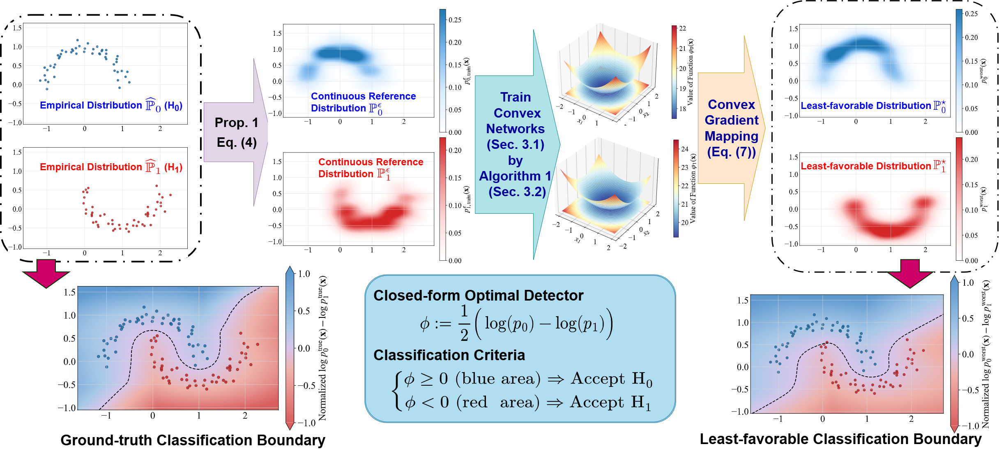

# Convex Generative Neural Networks for Sinkhorn Distributionally Robust Hypothesis Testing (SDRHT)

This library (Sinkhorn Distributionally Robust Hypothesis Testing) is an open source project that is based on our paper:&#x20;

**_Sinkhorn Distributionally Robust Hypothesis Testing_** (<https://arxiv.org/abs/>).&#x20;

```latex
@article{zhang2026,
  xxx
}
```

The experiments are coded in Python 3.8 and conducted on a personal computer equipped with an Intel Core i9-13900HX CPU, 32 GB of RAM, and an Nvidia GeForce RTX 4060 GPU. All GPU computations are performed using PyTorch 2.0.1 (utilizing CUDA 11.8).

The proposed method is illustrated below.&#x20;



In the following, we introduce all folders and files, as well as their usage procedures.&#x20;

## 1. Main Programs for Solving Hypothesis Testing Problems

| Files                              | Descriptions                                                                                                                                           |
| :--------------------------------- | :----------------------------------------------------------------------------------------------------------------------------------------------------- |
| **Experiment_Gaussian_Mixture.py** | Compare SDRO with WDRO, GMM, SVM, 3NN baselines on a synthetic **Gaussian mixture** dataset. All results will be recorded at Results/Gaussian_mixture. |
| **Experiment_MNIST.py**            | Compare SDRO with FDRO, WDRO, LR, SVM, 3NN baselines on the MNIST dataset. All results will be recorded at Results/MNIST.                              |
| **Experiment_Higgs.py**            | Compare SDRO with FDRO, LR, SVM, 3NN baselines on the Higgs dataset. All results will be recorded at Results/Higgs.                                    |

## 2. General Programs&#x20;

These programs will be called by the main programs.&#x20;

### 2.1 In Folder "**DataGenerators**"

This folder includes all data generators, which return training and testing sets to the main programs.

| Files                        | Descriptions                                                                                                                                     |
| :--------------------------- | :----------------------------------------------------------------------------------------------------------------------------------------------- |
| **Data_Gaussian_Mixture.py** | Data generator for the **Gaussian Mixture** dataset.                                                                                             |
| **Data_MNIST.py**            | Data generator for the **MNIST** dataset.                                                                                                        |
| **Data_Higgs.py**            | Data generator for the **Higgs** dataset. Note that this dataset needs to be downloaded at <https://archive.ics.uci.edu/dataset/280/higgs> first. |

### 2.2 In Folder "**Models**"

This folder includes all methods for solving the hypothesis testing problem.

| **Files**                | Descriptions                                                                                                                                                                                  |
| :----------------------- | :-------------------------------------------------------------------------------------------------------------------------------------------------------------------------------------------- |
| **SinkhornDRO.py**       | Train our SDRO hypothesis testing model using the Adam algorithm.                                                                                                                                    |
| **WDRO.py**              | Train WDRO (Wasserstein DRO) hypothesis testing model as a convex program (Xie et al., 2021).                                                                                                |
| **FDRO.py**              | Train FDRO (Flow-based DRO) hypothesis testing model by the method in Xu et al., 2024.                                                                                                            |
| **StandardBaselines.py** | Train classical baselines, including GMM (Gaussian Mixture Model, only for Gaussian mixture dataset), LR (Linear Regression), SVM (Support Vector Machine), and 3NN (3-layer neural network). |

### 2.3 In Folder "**Sinkhorn**"

This folder includes all functions for the proposed Sinkhorn Distributionally Robust Hypothesis Testing method.

| **Files**                   | Descriptions                                                                                                        |
| :-------------------------- | :------------------------------------------------------------------------------------------------------------------ |
| **ICNN.py**                 | Architecture of the traditional ICNN (Input Convex Neural Network).                                                 |
| **HyperICNN.py**            | Architecture of the HyperICNN (Hyper Input Convex Neural Network, proposed by Hundrieser et al., 2026).             |
| **Objective_estimation.py** | Estimator for the objective function and its gradient.                                                              |
| **logdet_estimators.py**    | Estimator for the log-determinant operator, copied from <https://github.com/CW-Huang/CP-Flow> (Huang et al., 2020). |
| **Evaluation.py**           | Evaluate the classification accuracy of SDRO for validation and testing sets.                                       |

### 2.4 In Folder "**Plotting**"

The only file in this folder draws all computational results and outputs them to the corresponding folders.

| Folders         | Descriptions                                 |
| :-------------- | :------------------------------------------- |
| **Plotting.py** | Functions to draw all computational results. |

# Prerequisites

    pip install -r requirements.txt

Here is the download link for the COPT solver <https://www.cardopt.com/copt>.

# References

\[1] Huang C W, Chen R T Q, Tsirigotis C, et al. Convex potential flows: Universal probability distributions with optimal transport and convex optimization\[J]. _arXiv preprint arXiv:2012.05942_, 2020.

\[2] Xie L, Gao R, Xie Y. Robust hypothesis testing with Wasserstein uncertainty sets\[J]. _arXiv preprint arXiv:2105.14348_, 2021.

\[3] Xu C, Lee J, Cheng X, et al. Flow-based distributionally robust optimization\[J]. _IEEE Journal on Selected Areas in Information Theory_, 2024, 5: 62-77.

\[4] Hundrieser S, Kong I, Schmidt-Hieber J. Hyper Input Convex Neural Networks for Shape Constrained Learning and Optimal Transport\[J]. _arXiv preprint arXiv:2604.26942_, 2026.
